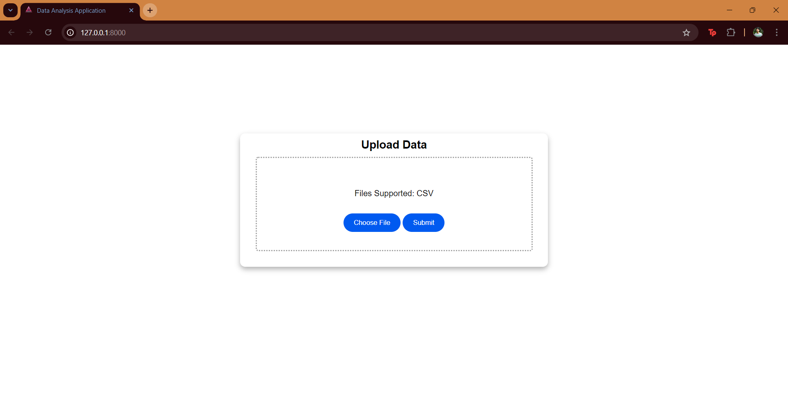
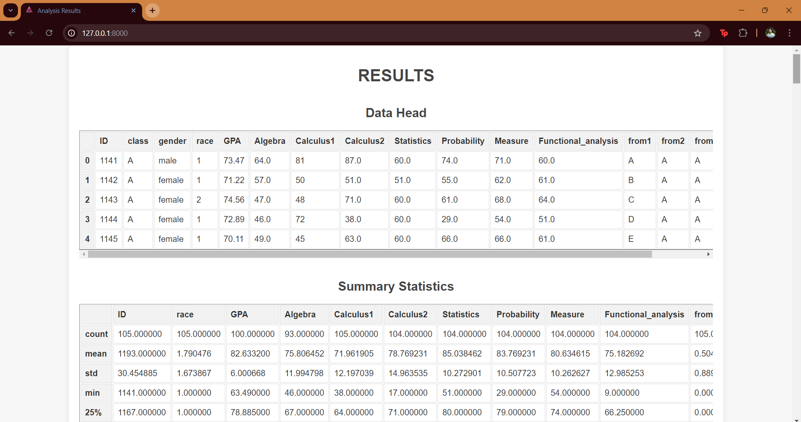
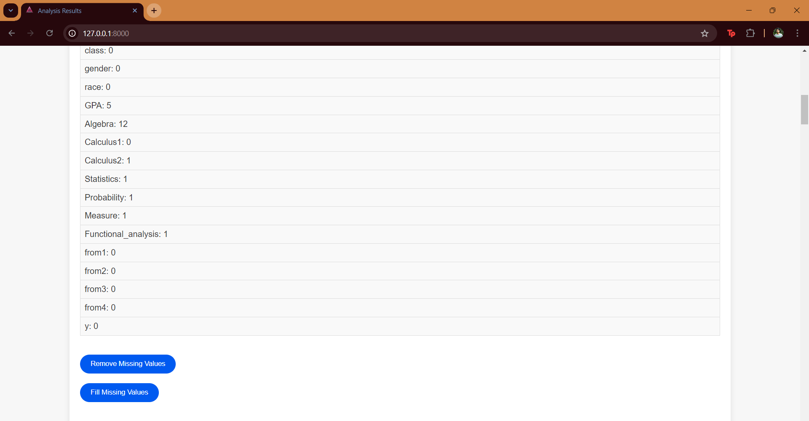

# Data Analysis Application

## Overview
The Data Analysis Application is a web-based tool for uploading, analyzing, and visualizing CSV data files. Developed with Django, it provides functionalities to handle missing values, generate plots, and display various statistics about the data.

## Features
- **Upload CSV Files**: Allows users to upload CSV files for analysis. Only CSV files are supported. Otherwise a warning is shown
- **Data Analysis**: Displays the head and summary statistics of the uploaded data.
- **Handle Missing Values**: Options to remove or fill missing values in the dataset.  
- **Visualization**: Generates histograms and combined histograms of numerical columns in the data.

   **This is the landing page where you can upload your CSV file**

**This is the results page for analysis**

**You can remove or fill the missing columns. After filling the count will be updated**

## Installation
To set up and run the project locally, follow these steps:
1. **Ensure you have installed Python and VSCode(optional)**:
2.  **Clone the Repository using the web url**:
   https://github.com/cks844/Data_Analysis_Webapplication.git
3. **Navigate to the project folder by using the command in IDE terminal**:
   cd project
4. **Install the required libraries by using the command in IDE terminal**:
   pip install -r requirements.txt
5. **For Migration**:
   python manage.py migrate
6. **For running the application**:
   python manage.py runserver
7. **To access the application**:
   http://127.0.0.1:8000/

## Usage
1. **Upload a CSV File**:
   Navigate to the landing page and upload a CSV file using the provided form.
2. **View Data**: 
   After uploading, you can view the data head and summary statistics.
3. **Handle Missing Values**:
   Use the provided buttons to remove or fill missing values in the dataset.
4. **Visualize Data**:
   The application will generate and display histograms for the numerical columns in your data.

   
